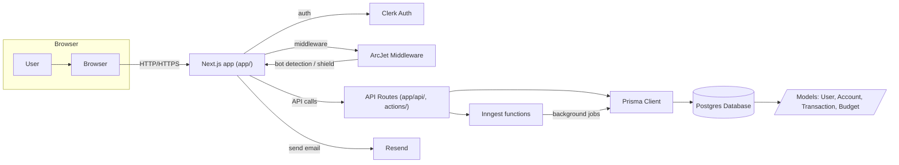

<div align="center">
	
	<h1>AI Finance Platform</h1>
	<p><strong>The flagship project of my internship &mdash; a next-generation, AI-powered personal finance platform.</strong></p>
</div>

---

## Overview

AI Finance Platform is a state-of-the-art web application designed to empower users to manage their finances with intelligence, security, and ease. Built with the latest technologies in the modern web stack, it seamlessly integrates authentication, real-time bot protection, background automation, and robust data visualization. This project exemplifies best practices in full-stack engineering and is the centerpiece of my internship portfolio.

---

## Features

- **Modern UI/UX:** Built with Next.js 15 App Router, Tailwind CSS, and Shadcn UI for a beautiful, responsive experience.
- **Secure Authentication:** Powered by Clerk, ensuring user data privacy and seamless onboarding.
- **Bot & Threat Protection:** ArcJet middleware shields the platform from bots and malicious actors in real time.
- **Automated Workflows:** Inngest enables background jobs for recurring transactions and notifications.
- **Powerful Data Layer:** Prisma ORM with PostgreSQL for scalable, type-safe persistence.
- **AI & Automation Ready:** Integrates with Google Gemini and other AI APIs for future expansion.
- **Transactional Email:** Resend integration for reliable, branded email delivery.
- **Extensible & Maintainable:** Modular codebase with clear separation of concerns and best practices throughout.

---

## Quick Start

1. **Install dependencies:**
   ```bash
   npm install
   ```
2. **Configure environment:**
   Create a `.env` file in the root directory with the following variables:
   ```
   DATABASE_URL=
   DIRECT_URL=
   NEXT_PUBLIC_CLERK_PUBLISHABLE_KEY=
   CLERK_SECRET_KEY=
   NEXT_PUBLIC_CLERK_SIGN_IN_URL=/sign-in
   NEXT_PUBLIC_CLERK_SIGN_UP_URL=/sign-up
   NEXT_PUBLIC_CLERK_AFTER_SIGN_IN_URL=/onboarding
   NEXT_PUBLIC_CLERK_AFTER_SIGN_UP_URL=/onboarding
   GEMINI_API_KEY=
   RESEND_API_KEY=
   ARCJET_KEY=
   ```
3. **Generate Prisma client:**
   ```bash
   npx prisma generate
   ```
4. **Run the development server:**
   ```bash
   npm run dev
   ```

---

## Project Structure

- `app/` &mdash; Next.js App Router pages and layouts
- `components/` &mdash; Reusable UI components
- `actions/` &mdash; Server-side business logic
- `lib/` &mdash; Utilities, Prisma client, integrations
- `prisma/` &mdash; Database schema and migrations
- `emails/` &mdash; Transactional email templates

---

## System Architecture & Data Flow

Below is a high-level data flow diagram illustrating how users, middleware, APIs, background jobs, and third-party services interact within the platform.



---

## Database Schema — Entity Relationship Diagram (ERD)

The following ERD is generated from the Prisma schema and visualizes the core data model of the platform:

```mermaid
erDiagram
	USERS {
		String id PK
		String clerkUserId
		String email
		String name OPTIONAL
		String imageUrl OPTIONAL
		DateTime createdAt
	}
	ACCOUNTS {
		String id PK
		String name
		AccountType type
		Decimal balance
		Boolean isDefault
		String userId FK
		DateTime createdAt
	}
	TRANSACTIONS {
		String id PK
		TransactionType type
		Decimal amount
		String description OPTIONAL
		DateTime date
		String category
		String receiptUrl OPTIONAL
		Boolean isRecurring
		RecurringInterval recurringInterval OPTIONAL
		DateTime nextRecurringDate OPTIONAL
		TransactionStatus status
		String userId FK
		String accountId FK
		DateTime createdAt
	}
	BUDGETS {
		String id PK
		Decimal amount
		DateTime lastAlertSent OPTIONAL
		String userId FK UNIQUE
		DateTime createdAt
	}

	USERS ||--o{ ACCOUNTS : has
	USERS ||--o{ TRANSACTIONS : creates
	USERS ||--|| BUDGETS : has_1to1
	ACCOUNTS ||--o{ TRANSACTIONS : contains

```

---

## Environment & Integrations

This platform leverages several third-party services. Ensure all required API keys and secrets are set in your `.env` file. For more details, see `middleware.js`, `lib/`, and `actions/`.

---

## Professional Notes

- **Code Quality:** The codebase follows modern best practices, with modularity, type safety, and clear separation of concerns.
- **Scalability:** Designed for easy extension, whether adding new features, AI integrations, or scaling to production.
- **Security:** Implements robust authentication, authorization, and bot protection at every layer.
- **Portfolio Ready:** This project demonstrates advanced full-stack skills and is suitable for professional and academic presentation.

---

<div align="center">
	<em>Thank you for reviewing my flagship internship project!</em><br/>
	<strong>— Nilav</strong>
</div>
---
